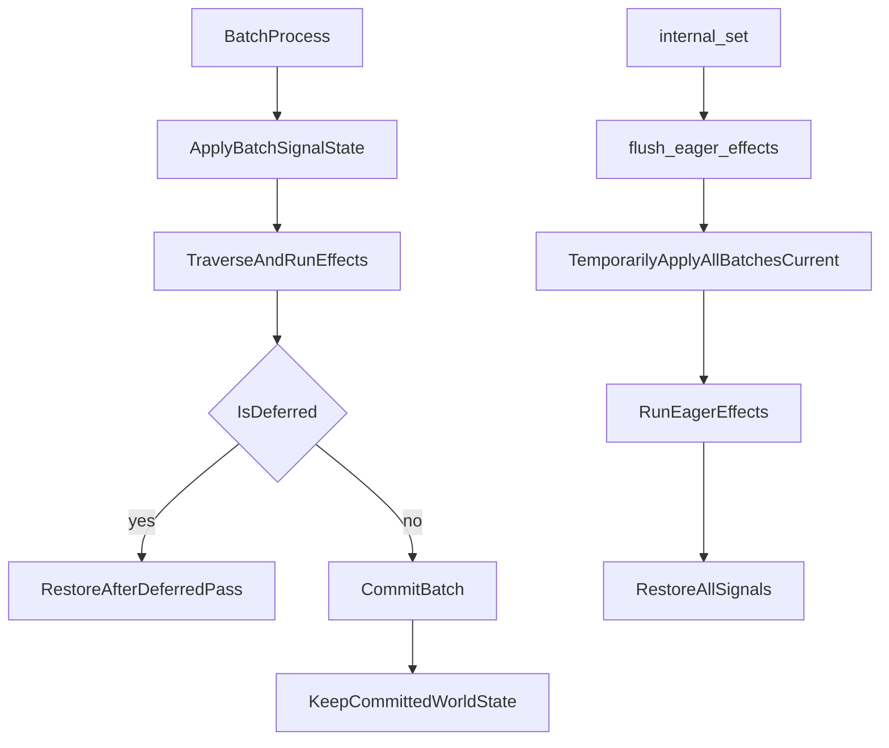

# Remove `batch_values` via direct signal state swapping

## Scope and target files

- Core batch orchestration: `[C:/repos/svelte/svelte/packages/svelte/src/internal/client/reactivity/batch.js](C:/repos/svelte/svelte/packages/svelte/src/internal/client/reactivity/batch.js)`
- Read path and dirty checks: `[C:/repos/svelte/svelte/packages/svelte/src/internal/client/runtime.js](C:/repos/svelte/svelte/packages/svelte/src/internal/client/runtime.js)`
- Derived recomputation/cache behavior: `[C:/repos/svelte/svelte/packages/svelte/src/internal/client/reactivity/deriveds.js](C:/repos/svelte/svelte/packages/svelte/src/internal/client/reactivity/deriveds.js)`
- Source invalidation/eager flushing: `[C:/repos/svelte/svelte/packages/svelte/src/internal/client/reactivity/sources.js](C:/repos/svelte/svelte/packages/svelte/src/internal/client/reactivity/sources.js)`

## Implementation strategy

1. Replace the global `batch_values` map with explicit apply/restore of real signal fields (`v`, and for deriveds additional metadata) during batch activation/processing.
2. After each deferred processing pass, unapply (restore) all overridden source/derived state so waiting batches do not leak their view while other batches run.
3. Add temporary "all-batches latest" overrides for eager evaluation so eager expressions can read every batch’s `current` value directly from signals.

## Concrete changes

- In `[batch.js](C:/repos/svelte/svelte/packages/svelte/src/internal/client/reactivity/batch.js)`:
  - Introduce batch-local snapshot storage for every signal the batch overrides (first-write snapshot only):
    - For all values: previous `v`.
    - For deriveds: previous status bits (`DIRTY`/`MAYBE_DIRTY`/`CLEAN`) and `wv`.
  - Rework `apply()` to:
    - Compute the same precedence as today (`this.current` first, then other batches’ `previous` fallback when missing).
    - Materialize that precedence by mutating real signals instead of writing to `batch_values`.
  - Add inverse restore logic used on batch deactivation/end-of-process, including deferred passes.
  - Ensure deferred batches always leave processing in restored state; re-apply on next activation/traversal.
  - Replace `capture()`’s `batch_values?.set(...)` behavior with state tracking APIs that record in-batch value intent and support re-application after async pauses.
  - Add helper for eager path: temporarily apply `current` values from all batches, run callback, then restore.
- In `[runtime.js](C:/repos/svelte/svelte/packages/svelte/src/internal/client/runtime.js)`:
  - Remove `batch_values` import/lookup from `get()` and always read from actual signal fields.
  - Replace the `batch_values === null` guard in `is_dirty()` with a new "batch state override active" guard so connected reactions are not prematurely forced to `CLEAN` during cross-batch traversal.
- In `[deriveds.js](C:/repos/svelte/svelte/packages/svelte/src/internal/client/reactivity/deriveds.js)`:
  - Remove `batch_values` writes/branches in `update_derived()`.
  - Ensure when a derived is recalculated under a batch override, its batch-scoped state captures and restores:
    - value (`v`),
    - write version (`wv`),
    - status bits relevant to `is_dirty`/`update_derived_status`.
  - Preserve existing fork semantics (do not persist fork-only writes to canonical world until commit).
- In `[sources.js](C:/repos/svelte/svelte/packages/svelte/src/internal/client/reactivity/sources.js)`:
  - Remove `batch_values?.delete(derived)` invalidation and replace with batch-managed derived-state invalidation/reset hooks.
  - Keep eager flushing behavior but route eager reads through the new temporary all-batch override helper.
- In eager handling in `[batch.js](C:/repos/svelte/svelte/packages/svelte/src/internal/client/reactivity/batch.js)`:
  - Replace the `batch_values = null` trick in `eager(...)` with a scoped "apply all batches’ current values" section, then restore.

## Derived dirtiness invariants to preserve

- Dirty checks still hinge on `dep.wv > reaction.wv` and status bits.
- During temporary batch overrides, we must avoid collapsing graph state to `CLEAN` in ways that hide work for other batches.
- After each deferred pass restore, every touched derived/source returns to its pre-override `v`/`wv`/status state.
- When committing (non-deferred), the committed world state remains, but transient per-batch override snapshots are cleared.

## Validation plan

- Run runtime suite from repo root: `pnpm test runtime`.
- If needed, isolate async/runtime-runes regressions by temporarily soloing affected samples and rerunning targeted suites.
- Specifically verify fork commit/discard, pending boundary deferral/revival, and eager updates inside concurrent batches.

